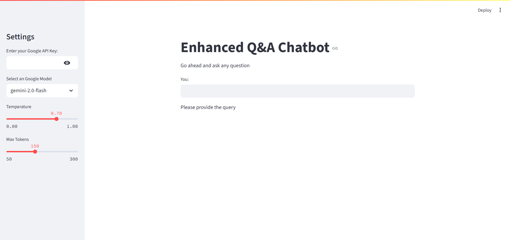

# 🤖 QA Chatbot — Intelligent Question Answering App using Google Gemini

 <!-- Replace this with your actual image path -->

QA Chatbot is an interactive question-answering application built using **Streamlit** and **LangChain**, integrated with **Google's Gemini** models (like `gemini-1.5-pro`, `gemini-2.0-flash`). It enables real-time responses to any query using powerful LLMs (Large Language Models).

---

## ✨ Features

- 🔐 Secure API key input (via `.env`)
- 🧠 Supports multiple Gemini models: `gemini-1.5-pro`, `gemini-2.0-flash`, `gemini-1.5-flash`
- 🎛️ Customize temperature and max token output
- ⚡ Instant Q&A with clean, user-friendly interface
- 📊 LangChain integration with LangSmith tracking enabled

---

## 📦 Tech Stack

- [Streamlit](https://streamlit.io/)
- [LangChain](https://www.langchain.com/)
- [Google Generative AI (Gemini)](https://ai.google.dev/)
- Python 3.10+

---

## ⚙️ Setup Instructions

Follow these steps to set up the application on your local machine:

### 1. Clone the Repository

```bash
git clone https://github.com/anasmalik081/question-answering-chatbot.git
cd qa-chatbot
```

### 2. Create a Virtual Environment

Using Python:

```bash
python -m venv env
```

Or using Conda:

```bash
conda create -p venv python=3.10 -y
```

### 3. Activate the Environment

- **Windows (venv)**:
  ```bash
  .\env\Scripts\activate
  ```
- **macOS/Linux**:
  ```bash
  source env/bin/activate
  ```

### 4. Install Requirements

```bash
pip install -r requirements.txt
```

### 5. Set Up Environment Variables

Create a `.env` file in the root directory and add your LangChain API key:

```env
LANGCHAIN_API_KEY=your_langchain_api_key_here
```

> ⚠️ You will also be asked to input your **Google Generative AI API key** inside the app sidebar during runtime.

### 6. Run the Application

```bash
streamlit run app.py
```

---

## 🖼️ Sample UI

> Replace the placeholder below with your own screenshot or gif inside the `assets/` folder.


---

## 📁 File Structure

```
qa-chatbot/
├── app.py
├── requirements.txt
├── .env.example
├── README.md
└── assets/
    └── qa-chatbot-demo.png
```

---

## 🙋‍♂️ Contributing

Contributions are welcome! Feel free to open issues or submit pull requests for improvements or new features.
---

## 📬 Contact

- **Author**: Anas Malik  
- **LinkedIn**: [linkedin.com/in/anas-malik-01](https://linkedin.com/in/anas-malik-01)

---

> Made with ❤️ using LangChain + Streamlit + Gemini
